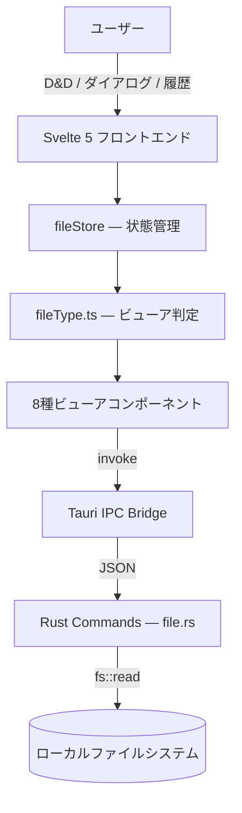

# 🔍 FileViewer

[](https://opensource.org/licenses/Apache-2.0)
[](https://v2.tauri.app/)
[](https://svelte.dev/)
[](https://www.typescriptlang.org/)
[](https://www.rust-lang.org/)
[](https://tailwindcss.com/)

> **ローカルファイル専用の軽量デスクトップビューア。Web接続を完全に排除し、集中を守る。**

<!-- スクリーンショットが用意できたらここに追加

-->

## 📖 概要

FileViewerは、ローカルファイルを閲覧するためだけに設計された軽量デスクトップアプリケーションです。Tauri v2（Rust）をバックエンドに、Svelte 5をフロントエンドに採用し、Electronの約1/10のメモリ消費量で動作します。インターネット接続機能を一切持たないため、「ブラウザを開いたらネットサーフィンを始めてしまう」問題を根本から解決します。

### なぜ作ったのか（モチベーション）

- ローカルファイル（PDF、HTML、画像など）をブラウザで開くと、他のタブが目に入り**集中力が途切れる**
- Chrome等の汎用ブラウザでは、**ついWebクローリングを始めてしまい**本来の作業に戻れなくなる
- ファイルを閲覧するだけなのに、**重いブラウザを起動してリソースを無駄に消費**している

## ✨ 主な機能

- **8種類のファイルビューア**: PDF / Markdown / 画像 / CSV / JSON / YAML / HTML / テキスト・コードをネイティブ品質で表示
- **タブ管理**: 複数ファイルをタブで切り替え。ブラウザのようなタブUIで直感的に操作
- **ドラッグ&ドロップ**: ファイルをウィンドウにドロップするだけで即座に表示
- **ファイル履歴**: 最近開いたファイルをサイドバーからワンクリックで再アクセス
- **ダークモード**: ライト/ダークテーマの切り替え対応
- **完全オフライン**: インターネット接続を一切行わない設計。HTMLビューアも `iframe sandbox=""` で外部通信を完全ブロック

## 🛠 技術スタック

| カテゴリ | 技術 |
|:--|:--|
| デスクトップフレームワーク | Tauri v2 (Rust) |
| フロントエンド | Svelte 5 + TypeScript |
| スタイリング | Tailwind CSS v4 |
| ビルドツール | Vite 6 |
| パッケージ管理 | pnpm |
| PDF表示 | pdfjs-dist v5 |
| Markdown | marked + highlight.js |
| CSV解析 | papaparse |
| シンタックスハイライト | shiki |
| 開発環境 | Docker + docker-compose |

## 🏗 アーキテクチャ



```
src-tauri/           # Rust バックエンド
├── src/commands/    #   Tauri コマンド（テキスト/バイナリ読み込み, メタ情報取得）
src/                 # Svelte フロントエンド
├── lib/components/  #   UI（Sidebar, TabBar, FileDropZone, 8種 Viewers）
├── lib/stores/      #   状態管理（fileStore, settingsStore）
├── lib/utils/       #   ユーティリティ（fileType, fileReader）
└── routes/          #   SvelteKit ルーティング
```

詳細は [docs/02_architecture.md](docs/02_architecture.md) を参照してください。

## 🚀 はじめ方

### 前提条件

- [Rust](https://www.rust-lang.org/tools/install) (1.82+)
- [Node.js](https://nodejs.org/) (22+)
- [pnpm](https://pnpm.io/) (9+)
- macOS: Xcode Command Line Tools
- Linux: [Tauri の依存パッケージ](https://v2.tauri.app/start/prerequisites/)

### セットアップ

```bash
# リポジトリをクローン
git clone https://github.com/ryusei2790/fileViewer.git
cd fileViewer

# 依存関係をインストール
pnpm install

# 開発サーバーを起動（Tauri + Vite）
pnpm tauri dev
```

デスクトップアプリとして自動的にウィンドウが開きます。

### Docker を使った開発（フロントエンドのみ）

```bash
# Docker 開発環境を起動
docker compose up -d

# コンテナ内で lint / check を実行
docker compose exec dev pnpm check
```

> **Note**: `pnpm tauri dev` はホストのmacOS WebKitに依存するため、Tauri アプリ起動はホスト側で行います。Docker はフロントエンドのビルド・リントに使用します。

### ビルド

```bash
# リリースビルド
pnpm tauri build
```

## 📝 対応ファイル形式

| ファイルタイプ | 拡張子 | ビューア |
|:--|:--|:--|
| PDF | `.pdf` | pdfjs-dist によるページ単位描画 |
| Markdown | `.md`, `.markdown` | marked + highlight.js による変換表示 |
| 画像 | `.png`, `.jpg`, `.gif`, `.svg`, `.webp` | ネイティブ img 表示 |
| CSV | `.csv`, `.tsv` | papaparse によるテーブル表示 |
| JSON | `.json` | shiki によるハイライト + 整形 |
| YAML | `.yml`, `.yaml` | shiki によるハイライト |
| HTML | `.html`, `.htm` | iframe sandbox で安全表示 |
| テキスト・コード | `.txt`, `.js`, `.ts`, `.py`, `.rs` 他 | shiki によるシンタックスハイライト |

## 📄 ライセンス

このプロジェクトは [Apache License 2.0](LICENSE) の下で公開されています。
