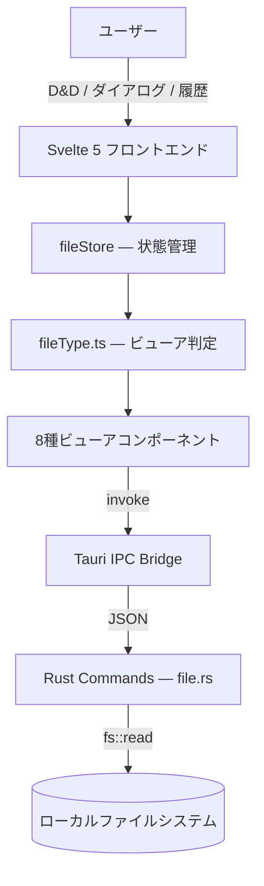

# 🔍 FileViewer

[](https://opensource.org/licenses/Apache-2.0)
[](https://v2.tauri.app/)
[](https://svelte.dev/)
[](https://www.typescriptlang.org/)
[](https://www.rust-lang.org/)
[](https://tailwindcss.com/)

> **ローカルファイル専用の軽量デスクトップビューア。Web接続を完全に排除し、集中を守る。**

<!-- スクリーンショットが用意できたらここに追加

-->

---

## 📖 概要

FileViewerは、ローカルファイルを閲覧するためだけに設計された軽量デスクトップアプリケーションです。Tauri v2（Rust）をバックエンドに、Svelte 5をフロントエンドに採用し、Electronの約1/10のメモリ消費量で動作します。インターネット接続機能を一切持たないため、「ブラウザを開いたらネットサーフィンを始めてしまう」問題を根本から解決します。

### なぜ作ったのか（モチベーション）

- ローカルファイル（PDF、HTML、画像など）をブラウザで開くと、他のタブが目に入り**集中力が途切れる**
- Chrome等の汎用ブラウザでは、**ついWebクローリングを始めてしまい**本来の作業に戻れなくなる
- ファイルを閲覧するだけなのに、**重いブラウザを起動してリソースを無駄に消費**している

---

## ✨ 主な機能

| 機能 | 説明 |
|:--|:--|
| **8種類のファイルビューア** | PDF / Markdown / 画像 / CSV / JSON / YAML / HTML / テキスト・コードをネイティブ品質で表示 |
| **タブ管理** | 複数ファイルをタブで切り替え。ブラウザのようなタブUIで直感的に操作 |
| **ドラッグ&ドロップ** | ファイルをウィンドウにドロップするだけで即座に表示 |
| **ファイル履歴** | 最近開いたファイルをサイドバーからワンクリックで再アクセス |
| **ダークモード** | ライト/ダークテーマの切り替え対応（OS設定に連動） |
| **完全オフライン** | インターネット接続を一切行わない設計。HTMLビューアも `iframe sandbox=""` で外部通信を完全ブロック |

---

## 🛠 技術スタック

| カテゴリ | 技術 |
|:--|:--|
| デスクトップフレームワーク | Tauri v2 (Rust) |
| フロントエンド | Svelte 5 + SvelteKit + TypeScript |
| スタイリング | Tailwind CSS v4 |
| ビルドツール | Vite 6 |
| パッケージ管理 | pnpm |
| PDF表示 | pdfjs-dist v5 |
| Markdown | marked + highlight.js |
| CSV解析 | papaparse |
| シンタックスハイライト | shiki |
| 開発環境 | Docker + docker-compose |

---

## 🏗 アーキテクチャ



### ディレクトリ構成

```
fileViewer/
├── src/                          # Svelte フロントエンド
│   ├── routes/
│   │   ├── +layout.svelte        #   ルートレイアウト（CSS読み込み）
│   │   ├── +layout.ts            #   SSR無効化設定
│   │   └── +page.svelte          #   メインページ（ビューア切替ロジック）
│   ├── lib/
│   │   ├── components/
│   │   │   ├── Sidebar.svelte    #   サイドバー（ファイル選択 + 履歴）
│   │   │   ├── TabBar.svelte     #   タブバー（開いているファイルのタブ）
│   │   │   ├── FileDropZone.svelte #  ドラッグ&ドロップ受付エリア
│   │   │   └── viewers/          #   各種ビューアコンポーネント
│   │   │       ├── PdfViewer.svelte
│   │   │       ├── MarkdownViewer.svelte
│   │   │       ├── ImageViewer.svelte
│   │   │       ├── CsvViewer.svelte
│   │   │       ├── JsonViewer.svelte
│   │   │       ├── YamlViewer.svelte
│   │   │       ├── HtmlViewer.svelte
│   │   │       └── TextViewer.svelte
│   │   ├── stores/
│   │   │   ├── fileStore.svelte.ts    #  ファイル状態管理（$state rune）
│   │   │   └── settingsStore.svelte.ts #  テーマ等の設定管理
│   │   └── utils/
│   │       ├── fileType.ts       #   拡張子→ビューアタイプのマッピング
│   │       └── fileReader.ts     #   Tauriコマンド呼び出しラッパー
│   └── app.css                   #   グローバルCSS（Tailwind設定）
├── src-tauri/                    # Rust バックエンド
│   ├── src/
│   │   ├── main.rs               #   エントリポイント
│   │   ├── lib.rs                #   Tauriアプリ初期化・プラグイン登録
│   │   └── commands/
│   │       ├── mod.rs            #   コマンドモジュール宣言
│   │       └── file.rs           #   ファイル読み込み・メタ情報取得
│   ├── Cargo.toml                #   Rust依存関係
│   └── tauri.conf.json           #   Tauriアプリ設定
├── docker-compose.yml            # Docker開発環境
├── Dockerfile.dev                # 開発用Dockerイメージ
├── package.json
├── svelte.config.js
├── vite.config.js
└── tsconfig.json
```

詳細は [docs/02_architecture.md](docs/02_architecture.md) を参照してください。

---

## 📝 対応ファイル形式

| ファイルタイプ | 拡張子 | ビューア | 読み込み方式 |
|:--|:--|:--|:--|
| PDF | `.pdf` | pdfjs-dist によるCanvas描画 | バイナリ（base64） |
| Markdown | `.md`, `.markdown` | marked + highlight.js による変換表示 | テキスト（UTF-8） |
| 画像 | `.png`, `.jpg`, `.gif`, `.webp` | ネイティブ img 表示 | バイナリ（base64） |
| 画像（SVG） | `.svg` | ネイティブ img 表示 | テキスト（UTF-8） |
| CSV | `.csv`, `.tsv` | papaparse によるテーブル表示 | テキスト（UTF-8） |
| JSON | `.json` | shiki によるハイライト + 整形 | テキスト（UTF-8） |
| YAML | `.yml`, `.yaml` | shiki によるハイライト | テキスト（UTF-8） |
| HTML | `.html`, `.htm` | iframe sandbox で安全表示 | テキスト（UTF-8） |
| テキスト・コード | `.txt`, `.js`, `.ts`, `.py`, `.rs`, `.go`, `.java`, `.c`, `.cpp`, `.h`, `.sh`, `.toml`, `.xml`, `.sql` 他 | shiki によるシンタックスハイライト | テキスト（UTF-8） |

---

## 🖥 使い方

### ファイルを開く（3つの方法）

#### 方法1: ドラッグ&ドロップ

1. アプリを起動する
2. 表示したいファイルをアプリのウィンドウにドラッグ&ドロップする
3. ファイルの種類に応じたビューアが自動で起動する

#### 方法2: ファイル選択ダイアログ

1. 左サイドバーの **「ファイルを開く」** ボタンをクリック
2. OS標準のファイル選択ダイアログが開く
3. 対応する拡張子のファイルのみが表示されるので、ファイルを選択して「開く」をクリック

#### 方法3: 最近開いたファイルから再アクセス

1. 左サイドバーの **「最近開いたファイル」** セクションを確認
2. 履歴に表示されたファイル名をクリックすると再度開く（最大20件保持）

### タブの操作

| 操作 | 方法 |
|:--|:--|
| タブ切り替え | タブをクリック |
| タブを閉じる | タブにホバーして表示される **×** ボタンをクリック |
| 新しいファイルを追加 | 上記3つの方法でファイルを開くと、新しいタブが追加される |

> 既に開いているファイルを再度開いた場合、新しいタブは作成されず、既存のタブがアクティブになります。

### テーマの切り替え

- 左サイドバーのヘッダーにある **🌙 / ☀️ ボタン** をクリックして切り替え
- 初回起動時はOSの設定（ライト/ダーク）に自動で合わせる

---

## 🚀 はじめ方（セットアップ）

### 前提条件

| ツール | バージョン | インストール方法 |
|:--|:--|:--|
| Rust | 1.82+ | [rustup.rs](https://rustup.rs/) |
| Node.js | 22+ | [nodejs.org](https://nodejs.org/) |
| pnpm | 9+ | `corepack enable && corepack prepare pnpm@latest --activate` |
| Xcode CLI Tools（macOS） | — | `xcode-select --install` |
| Tauri依存パッケージ（Linux） | — | [Tauri Prerequisites](https://v2.tauri.app/start/prerequisites/) |

### インストール & 起動

```bash
# 1. リポジトリをクローン
git clone https://github.com/ryusei2790/fileViewer.git
cd fileViewer

# 2. フロントエンドの依存関係をインストール
pnpm install

# 3. 開発モードで起動（Rust + Vite が同時に起動し、デスクトップアプリが開く）
pnpm tauri dev
```

初回の `pnpm tauri dev` では Rust の依存クレートのダウンロード＆コンパイルが行われるため、数分かかります。2回目以降はキャッシュが効くため高速です。

起動すると FileViewer のウィンドウが自動で開きます（1200×800px）。

---

## 🧑‍💻 開発ガイド

### 開発コマンド一覧

| コマンド | 説明 |
|:--|:--|
| `pnpm tauri dev` | **Tauriアプリとして開発起動**（Rust + Vite同時起動、HMR対応） |
| `pnpm dev` | フロントエンドのみ起動（Vite devサーバー、`http://localhost:1420`） |
| `pnpm check` | SvelteKit の型チェック実行 |
| `pnpm check:watch` | 型チェックをウォッチモードで実行 |
| `pnpm build` | フロントエンドのプロダクションビルド |
| `pnpm tauri build` | **リリース用ネイティブバイナリをビルド** |

### フロントエンドのみの開発（ブラウザで確認）

Tauriのネイティブ機能（ファイル選択ダイアログ、ドラッグ&ドロップ）を使わないUI調整は、Viteのdevサーバー単体で行えます。

```bash
pnpm dev
# → http://localhost:1420 をブラウザで開く
```

> **注意**: ブラウザでの起動時は Tauri API（`invoke`、`getCurrentWindow` 等）が利用できないため、ファイルの読み込み機能は動作しません。UIレイアウトやスタイリングの確認に使用してください。

### Tauriアプリとしての開発

ファイル読み込みを含むフル機能のテストには、Tauriアプリとして起動してください。

```bash
pnpm tauri dev
```

- Svelte/TypeScript の変更は **HMR（ホットモジュールリロード）** で即座に反映
- Rust（`src-tauri/src/`）の変更は **自動で再コンパイル＆再起動** される

### Docker を使った開発（フロントエンドのみ）

```bash
# Docker 開発環境を起動（Vite devサーバーがコンテナ内で起動）
docker compose up -d

# コンテナ内で型チェックを実行
docker compose exec dev pnpm check

# コンテナを停止
docker compose down
```

> **Note**: `pnpm tauri dev` はホストOSのWebKitランタイムに依存するため、Tauriアプリ起動はホスト側で行います。Docker はフロントエンドのビルド・型チェック・リントに使用します。

### 新しいファイルタイプを追加する

FileViewerに新しいファイルタイプのサポートを追加するには、以下の3ステップで行います。

#### Step 1: `src/lib/utils/fileType.ts` にエントリを追加

```typescript
// VIEWER_REGISTRY に1行追加するだけ
const VIEWER_REGISTRY: Record<string, ViewerDef> = {
  // ... 既存エントリ ...
  newext: { type: 'text', readMode: 'text' },  // 既存ビューアを使う場合
};
```

#### Step 2: 新しいビューアが必要な場合のみ、コンポーネントを作成

```
src/lib/components/viewers/NewViewer.svelte
```

#### Step 3: `src/routes/+page.svelte` にビューアの分岐を追加

```svelte
{:else if fileStore.activeFile.viewerType === 'newtype'}
  <NewViewer path={fileStore.activeFile.path} />
```

### Rustバックエンドのカスタマイズ

Tauriコマンドは `src-tauri/src/commands/file.rs` に定義されています。新しいコマンドを追加する場合:

1. `file.rs` に `#[tauri::command]` 関数を追加
2. `src-tauri/src/lib.rs` の `invoke_handler` にコマンドを登録
3. `src/lib/utils/fileReader.ts` にフロントエンド側のラッパー関数を追加

---

## 📦 ビルド & デプロイ（配布）

### リリースビルド

```bash
pnpm tauri build
```

ビルド成果物は `src-tauri/target/release/bundle/` に出力されます。

### プラットフォーム別の出力

| OS | 出力形式 | パス |
|:--|:--|:--|
| macOS | `.app` / `.dmg` | `src-tauri/target/release/bundle/macos/` <br> `src-tauri/target/release/bundle/dmg/` |
| Windows | `.msi` / `.exe` (NSIS) | `src-tauri/target/release/bundle/msi/` <br> `src-tauri/target/release/bundle/nsis/` |
| Linux | `.deb` / `.AppImage` | `src-tauri/target/release/bundle/deb/` <br> `src-tauri/target/release/bundle/appimage/` |

> Tauriはクロスコンパイルをサポートしていません。macOS用バイナリはmacOSで、Windows用はWindowsでビルドする必要があります。

### macOS での配布手順

```bash
# 1. リリースビルド
pnpm tauri build

# 2. .dmg ファイルを確認
ls src-tauri/target/release/bundle/dmg/
# → FileViewer_0.1.0_aarch64.dmg (Apple Silicon)
# → FileViewer_0.1.0_x64.dmg (Intel Mac)

# 3. .dmg を配布先に共有（GitHub Releases等）
```

### GitHub Releases で配布する場合

```bash
# タグを作成してプッシュ
git tag v0.1.0
git push origin v0.1.0

# GitHub CLI でリリースを作成
gh release create v0.1.0 \
  src-tauri/target/release/bundle/dmg/*.dmg \
  --title "FileViewer v0.1.0" \
  --notes "初回リリース"
```

### CI/CD による自動ビルド（GitHub Actions）

マルチプラットフォームの自動ビルドを行いたい場合は、Tauri公式のGitHub Actionsを使用できます。

`.github/workflows/release.yml` の例:

```yaml
name: Release
on:
  push:
    tags:
      - 'v*'

jobs:
  release:
    permissions:
      contents: write
    strategy:
      fail-fast: false
      matrix:
        include:
          - platform: macos-latest
            args: --target aarch64-apple-darwin
          - platform: macos-latest
            args: --target x86_64-apple-darwin
          - platform: ubuntu-22.04
            args: ''
          - platform: windows-latest
            args: ''
    runs-on: ${{ matrix.platform }}
    steps:
      - uses: actions/checkout@v4

      - name: Setup Node.js
        uses: actions/setup-node@v4
        with:
          node-version: 22

      - name: Install pnpm
        run: corepack enable && corepack prepare pnpm@latest --activate

      - name: Install Rust stable
        uses: dtolnay/rust-toolchain@stable
        with:
          targets: ${{ matrix.platform == 'macos-latest' && 'aarch64-apple-darwin,x86_64-apple-darwin' || '' }}

      - name: Install dependencies (Ubuntu only)
        if: matrix.platform == 'ubuntu-22.04'
        run: |
          sudo apt-get update
          sudo apt-get install -y libwebkit2gtk-4.1-dev build-essential curl wget file libxdo-dev libssl-dev libayatana-appindicator3-dev librsvg2-dev

      - name: Install frontend dependencies
        run: pnpm install

      - name: Build Tauri app
        uses: tauri-apps/tauri-action@v0
        env:
          GITHUB_TOKEN: ${{ secrets.GITHUB_TOKEN }}
        with:
          tagName: ${{ github.ref_name }}
          releaseName: 'FileViewer ${{ github.ref_name }}'
          releaseBody: 'See the assets to download and install this version.'
          releaseDraft: true
          prerelease: false
          args: ${{ matrix.args }}
```

---

## 🐛 トラブルシューティング

### `pnpm tauri dev` でRustのコンパイルエラーが出る

```bash
# Rustツールチェインを最新に更新
rustup update stable

# キャッシュをクリアして再ビルド
cd src-tauri && cargo clean && cd ..
pnpm tauri dev
```

### Linux でビルドに失敗する

Tauriの依存パッケージが不足しています:

```bash
# Debian/Ubuntu
sudo apt-get install -y \
  libwebkit2gtk-4.1-dev build-essential curl wget file \
  libxdo-dev libssl-dev libayatana-appindicator3-dev librsvg2-dev
```

### `pnpm dev` で500エラーが表示される

ストアファイルが `.svelte.ts` 拡張子でない可能性があります。Svelte 5の `$state` runeは `.svelte` または `.svelte.ts` ファイルでのみ使用可能です。

```
# 正しいファイル名:
src/lib/stores/fileStore.svelte.ts     ✅
src/lib/stores/settingsStore.svelte.ts ✅

# 間違い:
src/lib/stores/fileStore.ts            ❌
src/lib/stores/settingsStore.ts        ❌
```

### ブラウザで開くとTauri APIエラーが出る

`pnpm dev` でブラウザから直接アクセスした場合、Tauriランタイムが存在しないため `getCurrentWindow` 等のAPIがエラーになります。これは正常な動作です。ファイル操作を含む完全な動作テストには `pnpm tauri dev` を使用してください。

---

## 📄 ライセンス

このプロジェクトは [Apache License 2.0](LICENSE) の下で公開されています。
