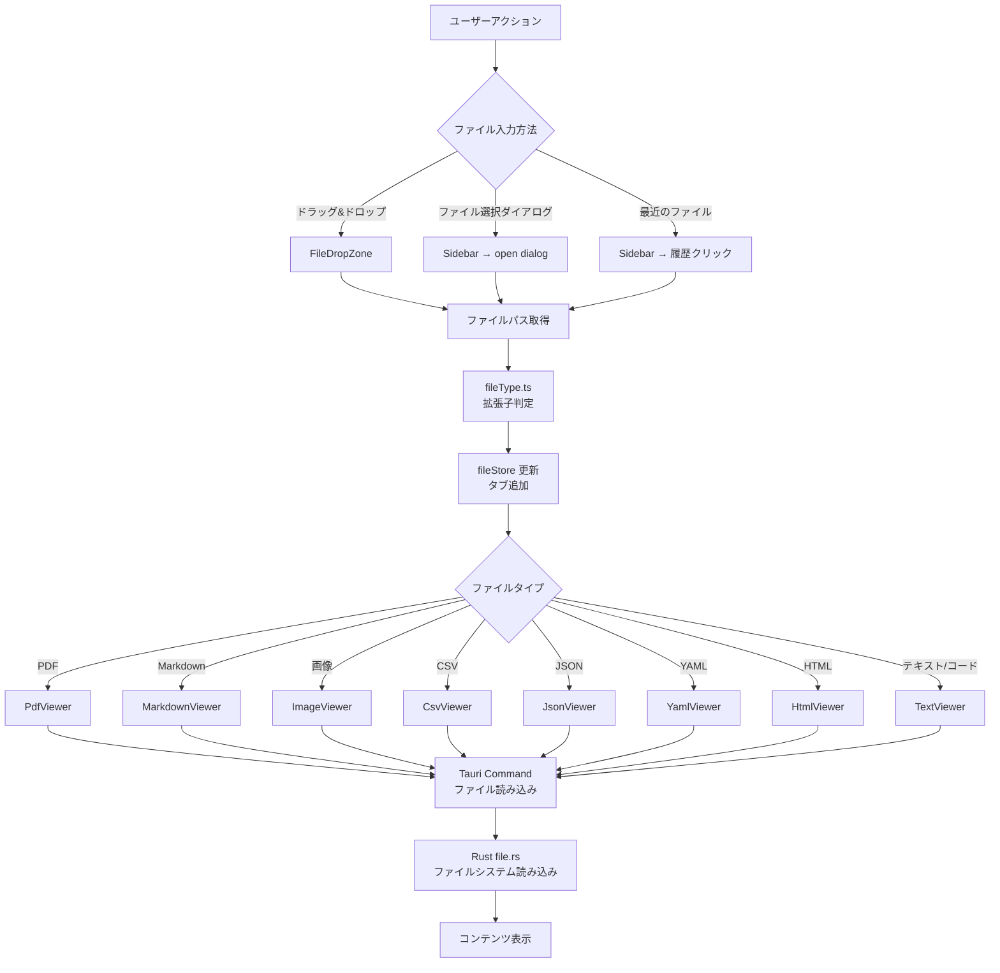
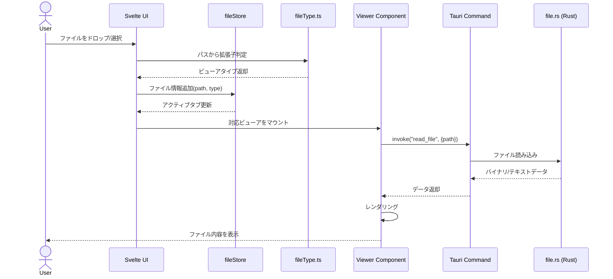
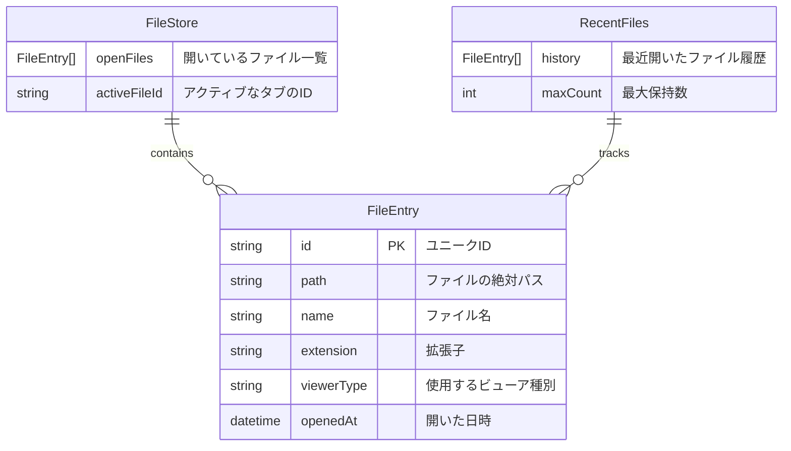

# Phase 2：アーキテクチャ設計

## ディレクトリ構成

```
fileViewer/
├── src-tauri/                  # Rust バックエンド
│   ├── src/
│   │   ├── main.rs             # Tauriエントリポイント
│   │   ├── lib.rs              # モジュール公開
│   │   └── commands/           # Tauriコマンド
│   │       ├── mod.rs          # コマンドモジュール公開
│   │       └── file.rs         # ファイル読み込み・メタ情報取得
│   ├── Cargo.toml
│   └── tauri.conf.json         # Tauri設定（ウィンドウ、権限）
├── src/                        # Svelte フロントエンド
│   ├── lib/
│   │   ├── components/         # UIコンポーネント
│   │   │   ├── Sidebar.svelte          # ファイル選択・履歴サイドバー
│   │   │   ├── FileDropZone.svelte     # ドラッグ&ドロップエリア
│   │   │   ├── TabBar.svelte           # タブ管理
│   │   │   └── viewers/                # ファイルタイプ別ビューア
│   │   │       ├── PdfViewer.svelte
│   │   │       ├── MarkdownViewer.svelte
│   │   │       ├── ImageViewer.svelte
│   │   │       ├── CsvViewer.svelte
│   │   │       ├── JsonViewer.svelte
│   │   │       ├── YamlViewer.svelte
│   │   │       ├── HtmlViewer.svelte
│   │   │       └── TextViewer.svelte
│   │   ├── stores/             # Svelte stores（状態管理）
│   │   │   ├── fileStore.ts        # 開いているファイルの状態
│   │   │   └── settingsStore.ts    # 設定（テーマ等）
│   │   └── utils/
│   │       ├── fileType.ts         # 拡張子→ビューアのマッピング
│   │       └── fileReader.ts       # Tauriコマンド呼び出しラッパー
│   ├── routes/
│   │   └── +page.svelte        # メインページ
│   ├── app.html
│   └── app.css
├── static/
├── package.json
├── svelte.config.js
├── tailwind.config.js
├── vite.config.ts
├── docker-compose.yml          # 開発環境用
└── docs/                       # 設計ドキュメント
```

## モジュール間の依存関係

```
Sidebar / FileDropZone
    ↓ (ファイルパスを渡す)
fileStore (状態管理)
    ↓ (アクティブファイル情報)
fileType.ts (ビューア判定)
    ↓ (適切なビューアを選択)
viewers/* (表示)
    ↓ (ファイル内容が必要な場合)
fileReader.ts → Tauri Command → file.rs (Rust)
```

## データの流れ

```
入力: ユーザー操作（D&D / ダイアログ / 履歴クリック）
  ↓
処理1: ファイルパス取得 → 拡張子判定（fileType.ts）
  ↓
処理2: Store更新（fileStore.ts）→ タブ追加・アクティブ切替
  ↓
処理3: Tauriコマンド呼び出し（fileReader.ts → Rust file.rs）
  ↓
処理4: ファイル内容を適切なビューアコンポーネントでレンダリング
  ↓
出力: 画面にファイル内容を表示
```

## Mermaid 設計図

### 処理フロー



### シーケンス図



### データモデル



## ブロック単位の運用フロー

### ブロック1：ファイル入力
```
ブロック名  : ファイル入力ブロック
入力データ  : ユーザー操作（D&D / ダイアログ / 履歴クリック）
処理内容    : ファイルパスを取得し、拡張子からビューアタイプを判定
出力データ  : FileEntry オブジェクト
次のブロック: 状態管理ブロック
```

### ブロック2：状態管理
```
ブロック名  : 状態管理ブロック
入力データ  : FileEntry オブジェクト
処理内容    : fileStoreにタブ追加、アクティブタブ切替、履歴更新
出力データ  : 更新されたStore状態
次のブロック: ビューア表示ブロック
```

### ブロック3：ビューア表示
```
ブロック名  : ビューア表示ブロック
入力データ  : アクティブなFileEntryのpath + viewerType
処理内容    : Tauriコマンドでファイル読み込み → 適切なビューアでレンダリング
出力データ  : 画面にファイル内容を表示
次のブロック: なし（ユーザーが次の操作を行うまで待機）
```

## 設計の自己レビュー

### 設計の懸念点
- 大きなPDFファイル（100MB超）を開いたときのメモリ消費
- HTMLビューアでJavaScriptを実行すると外部通信が発生する可能性（本来の目的に反する）
- ファイル履歴をどこに永続化するか

### 拡張性へのリスク
- ビューアを追加するたびに`viewers/`ディレクトリと`fileType.ts`の両方を変更する必要がある
- 将来的にファイル編集機能を追加する場合、ビューアの設計を大幅に変更する必要がある

### 推奨する対策
- PDFはページ単位の遅延読み込み（pdf.jsのデフォルト機能）で対応
- HTMLビューアは`iframe + sandbox`属性でネットワークアクセスを完全ブロック
- 履歴永続化はTauri Store plugin（JSONファイルベース）を使用。クラウド移行時にDB差し替え可能
- ビューアの登録をレジストリパターンにし、拡張子→コンポーネントのマッピングを1箇所で管理
