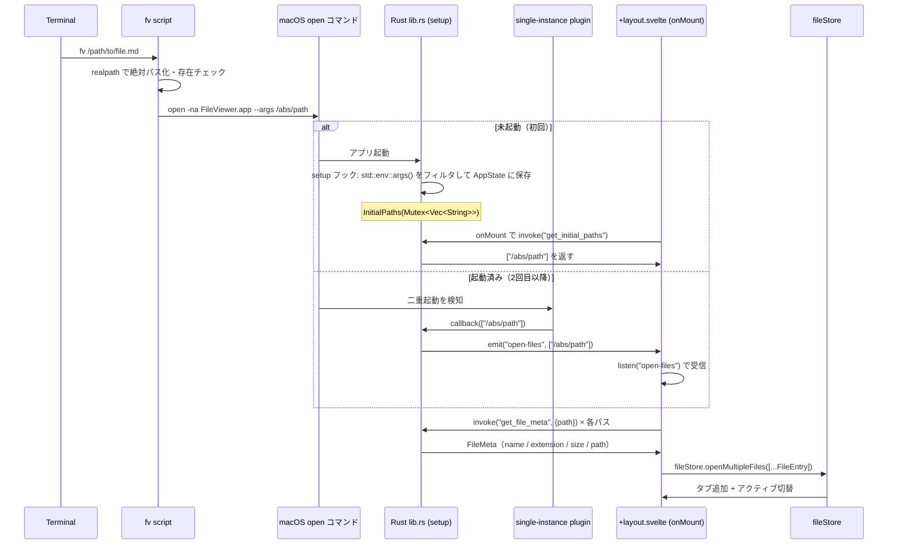

# 04 — CLI 統合設計：`fv` コマンド

> 作成日: 2026-05-18  
> フェーズ: Phase 1（技術選定）/ Phase 2（設計）  
> ステータス: 設計完了・実装待ち

---

## Phase 1：技術選定

### 1-1. 技術スタック全列挙

| カテゴリ | 採用 | 不採用（検討した候補） |
|---|---|---|
| CLI ラッパー | bash スクリプト (`/usr/local/bin/fv`) | zsh function (`.zshrc` 専用・移植性低)、Python スクリプト（過剰） |
| 単一インスタンス制御 | `tauri-plugin-single-instance` v2 | `tauri-plugin-deep-link`（URL スキーム専用）、自前 UNIX ソケット（過剰） |
| フロントエンド受信（再利用時） | Tauri Event `listen("open-files", ...)` | — |
| フロントエンド受信（初回起動） | Tauri command `get_initial_paths` | emit のみ（race condition リスク有り） |
| インストール先 | `/usr/local/bin/fv` (sudo 1回・`subl` と同方式) | `~/.local/bin/fv`（PATH 追加要）、`~/bin/fv`（同上） |

### 1-2. 単一インスタンス制御プラグイン比較

| | `tauri-plugin-single-instance` | `tauri-plugin-deep-link` | 自前 UNIX ソケット |
|---|---|---|---|
| Tauri 公式 | ✅ | ✅ | ❌ |
| 方式 | ファイルロック + IPC | macOS URL Scheme | socket bind |
| 複数ファイル指定 | ◎ 引数そのまま転送 | △ URL エンコード必要 | ◎ |
| 日本語パス対応 | ◎ | △ percent-encode 必要 | ◎ |
| 将来の拡張性 | ◎ オプションフラグ追加容易 | △ URL 構造に縛られる | △ 自前メンテ |
| **採用** | **✅** | ❌ | ❌ |

### 1-3. クラウド互換性

ローカル専用 CLI ツールのためクラウド移行は対象外。  
将来 FileViewer を Mac App Store 配布する場合、`single-instance` プラグインの sandboxing 対応（entitlements）を要確認。

---

## Phase 2：設計

### 2-1. 変更ファイル一覧

| ファイル | 種別 | 変更理由 |
|---|---|---|
| `src-tauri/Cargo.toml` | 変更 | `tauri-plugin-single-instance` 依存追加 |
| `src-tauri/src/lib.rs` | 変更 | plugin 登録 + callback で emit + setup で初期 args を AppState に保存 |
| `src-tauri/src/commands/app.rs` | 新規 | `get_initial_paths` コマンド（初回起動引数をフロントに渡す） |
| `src-tauri/src/commands/mod.rs` | 変更 | `pub mod app;` 追加 |
| `src/routes/+layout.svelte` | 変更 | `onMount` で初期パス取得 + `listen("open-files")` で追加起動対応 |
| `src/lib/utils/pathToFileEntry.ts` | 新規 | パス文字列 → `FileEntry` 変換ユーティリティ |
| `/usr/local/bin/fv` | 新規 (sudo) | CLI エントリポイント |

### 2-2. Mermaid 設計図



### 2-3. ブロック単位の運用フロー

```
ブロック名  : fv script
入力データ  : ターミナルからのパス文字列 ($@)
処理内容    : realpath で絶対パス化 → 存在チェック → open コマンド実行
出力データ  : macOS への open イベント（引数付き）
次のブロック: Rust setup / single-instance callback

ブロック名  : Rust setup (InitialPaths)
入力データ  : std::env::args() の 1番目以降（初回起動のみ）
処理内容    : "--" 始まり除外 → AppState に Vec<String> として保存
出力データ  : AppState (管理済み状態)
次のブロック: get_initial_paths コマンド（フロントが呼ぶまで待機）

ブロック名  : single-instance callback
入力データ  : 二重起動時の引数 Vec<String>
処理内容    : パスをフィルタして emit("open-files", paths)
出力データ  : Tauri グローバルイベント "open-files"
次のブロック: +layout.svelte の listen ハンドラ

ブロック名  : +layout.svelte
入力データ  : invoke("get_initial_paths") の戻り値 OR listen("open-files") のペイロード
処理内容    : 各パスに get_file_meta → FileEntry 生成 → fileStore.openMultipleFiles()
出力データ  : fileStore の状態更新
次のブロック: UI（タブバーに新タブ表示）
```

### 2-4. 設計の自己レビュー

#### 懸念点

- **初回起動 race condition**: `setup` フック完了後すぐに `emit` すると、SvelteKit の `onMount` が間に合わない可能性がある。
  → **対策**: emit せず `AppState` に引数を保存し、フロントが `onMount` 後に `invoke("get_initial_paths")` でプルする方式を採用（push ではなく pull）。

- **`fv .` フォルダ指定**: 現状の `get_file_meta` はファイル専用設計のため、フォルダパスが渡ると Rust 側でエラーになる可能性がある。
  → **対策**: 今回のスコープでは `fv` スクリプト側でフォルダを除外し警告を出す。フォルダ対応は別 issue で行う。

- **日本語・スペースを含むパスの shell quoting**: bash スクリプトで `"$@"` を使えばスペースは安全だが、`open --args` に渡す際も quote が必要。
  → **対策**: スクリプト内で `"$@"` を維持し、`open` コマンドへも正しく引用符付きで渡す。

#### 拡張性リスク

- `get_initial_paths` を呼んだ後も「アプリ内でリロード」すると再度呼ばれるため、同じファイルが重複して開かれる可能性がある。
  → 呼んだ後に `AppState` をクリアするか、`fileStore.openFile` の重複チェック（既存コードに実装済み）に任せる。

#### 推奨する追加対策

- `get_initial_paths` 呼び出し後に `InitialPaths` を空にする（一度だけ読めるワンショット設計）。
- `fv` スクリプトは将来 `-n`（新ウィンドウ）、`-w`（終了待機）などのオプションを追加しやすい構造にしておく（getopts 使用）。

---

## fv スクリプト設計（インターフェース仕様）

```
Usage:
  fv [file...]          ファイルを FileViewer で開く
  fv .                  フォルダは今回スコープ外（将来対応）

Examples:
  fv README.md
  fv src/main.rs tests/test.rs
  fv ~/Documents/report.pdf
```

スクリプト配置先: `/usr/local/bin/fv`（sudo 1 回必要）  
または: `/Applications/FileViewer.app/Contents/Resources/fv`（Tauri bundle resource として管理）にシンボリックリンク。

---

## 実装予定ブランチ

```
dev/cli-integration-fv-command
```

（GitHub issue 番号が決まり次第 `dev/<番号>-fv-command` に変更）
