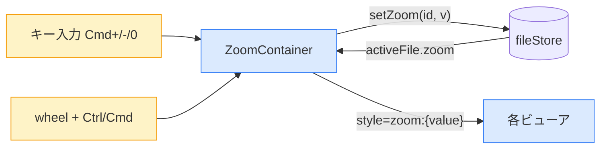
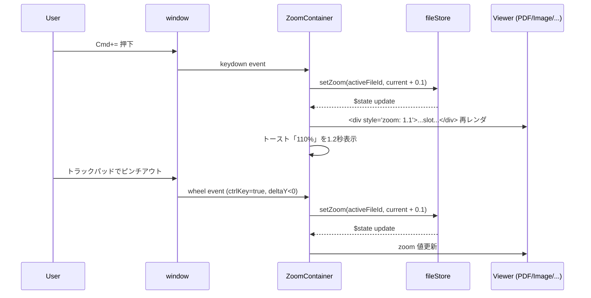

# 05. ズーム機能（拡大縮小） 設計ドキュメント

## 0. 背景と目的

### 現状のペイン
- ファイルを開いた後、文字や画像が小さすぎる/大きすぎるときに調整できない
- PDF / Markdown / 画像 / ソースコード など、どのビューアでも拡大縮小の操作が用意されていない
- macOS ネイティブアプリでは Cmd+/Cmd-/Cmd+0、トラックパッドのピンチが当たり前のように使えるため、これがないと体験が悪い

### 解決アプローチ
- 全 8 種ビューア（PDF / Markdown / Image / CSV / JSON / YAML / HTML / Text）に共通の Zoom 機能を提供する
- 操作系：
  - Ctrl/Cmd + ホイール（macOS のトラックパッドのピンチも `wheel` + `ctrlKey=true` として届く）
  - Cmd + `+` / `-` / `0`（リセット）
- 状態スコープ：タブ（ファイル）ごとに独立。アプリ再起動で 100% にリセット

---

## 1. 技術選定

### 1-1. 拡大縮小方式の候補比較

| 方式 | メリット | デメリット |
|------|---------|-----------|
| **A. CSS `zoom` プロパティ** | 全要素（テキスト、画像、Canvas、PDF）にレイアウト含めて自然に効く。スクロール位置・サイズも自動調整。実装が極めてシンプル | 旧 Firefox では非対応（ただし Tauri は使用 webview が WebKit/Chromium/WebKit2GTK なので問題なし） |
| B. CSS `transform: scale()` | クロスブラウザ対応 | レイアウトサイズが変わらず、スクロールやはみ出しの計算を手動で行う必要がある。PDF Canvas で軽くにじむ |
| C. ビューアごとに最適化（PDF は pdfjs scale 再描画、画像は CSS、テキストは font-size） | ビューアごとに最高品質 | 実装量が 8 倍、保守コスト大、共通インタフェース不在 |

**選定：A. CSS `zoom`**
- Tauri が使用する webview（macOS: WKWebView, Windows: WebView2(Chromium), Linux: WebKit2GTK）はすべて `zoom` をサポート
- 全ビューア共通の薄い `ZoomContainer` で完結し、保守コストが最小

### 1-2. クラウド互換性
- CSS のみで完結する標準仕様のため、将来の Web 版（Cloudflare Pages 等）への移植も同じコードで動く

---

## 2. アーキテクチャ設計

### 2-1. ディレクトリ構成（追加分のみ）

```
src/lib/
  components/
    ZoomContainer.svelte   ★新規：ズームラッパ + ショートカット
  stores/
    fileStore.svelte.ts    ◇拡張：FileEntry に zoom フィールド追加
```

### 2-2. 担当機能

| ファイル | 役割 |
|---------|------|
| `ZoomContainer.svelte` | ・active タブの zoom を fileStore から取得して `<div style="zoom: ...">` に適用<br>・`wheel` + Ctrl/Cmd でホイール/ピンチズーム<br>・`keydown` Cmd+/-/0 でステップズーム/リセット<br>・現在倍率を画面右下にトースト表示（数秒で fade-out） |
| `fileStore.svelte.ts` | ・`FileEntry.zoom: number` を追加（default 1.0）<br>・`setZoom(id, value)` メソッド追加 |
| `+page.svelte` | ・各ビューア呼び出しを `<ZoomContainer>` で包む |

### 2-3. データの流れ



### 2-4. ズーム挙動の仕様

| 項目 | 値 |
|------|---|
| デフォルト倍率 | 1.0（100%） |
| 最小倍率 | 0.25（25%） |
| 最大倍率 | 5.0（500%） |
| Cmd+/Cmd- のステップ | 10%（0.1）刻み |
| wheel/pinch のステップ | `deltaY` を 100 で割った値を 0.1 倍してから加算（macOS ピンチで自然な感触） |
| Cmd+0 | 1.0 にリセット |
| 状態スコープ | `FileEntry.zoom`（タブごと独立） |
| 永続化 | なし（再起動でリセット） |
| 表示インジケータ | 右下に `100%` などをトースト表示、1.2秒で fade-out |

### 2-5. キーボードショートカットの衝突回避
- `event.preventDefault()` を呼んでブラウザ既定のページ全体ズーム（Webview のフォントズーム）が走らないようにする
- 全画面イベントで処理：`window.addEventListener('keydown', ...)`、`window.addEventListener('wheel', ..., { passive: false })`
- `fileStore.activeFileId === null` の場合は無視（ドロップゾーン表示中はズーム対象なし）

### 2-6. macOS トラックパッドのピンチ検出
- macOS の Safari/WebKit はトラックパッドのピンチを「`wheel` イベントの `ctrlKey === true`」として synthesize する
- そのため `wheel + (ctrlKey || metaKey)` の同じハンドラで両対応できる
- `event.deltaY` の符号：`> 0` なら縮小、`< 0` なら拡大

---

## 3. 設計の自己レビュー

### 懸念点
1. **PDF Canvas の解像度低下**：`zoom` で拡大すると Canvas の元解像度のまま引き伸ばされ、文字がにじむ可能性がある
   - → 一般的な閲覧用途では問題なし。完全な高解像度が必要なら将来 pdfjs の scale 再描画を併用する別 issue とする
2. **トースト表示のレイヤ**：`position: fixed` で右下に出すと TabBar やサイドバーと衝突する可能性
   - → `z-index: 50`、`bottom-4 right-4` をメインエリア相対にする（`absolute` で囲い、外側コンテナを `relative` に）
3. **キーバインドの誤発火**：Markdown のテキスト編集はないが、将来編集 UI を入れたとき入力中の `+`/`-` を奪う恐れ
   - → 現状は安全。将来編集機能を追加するときは `e.target` が input/textarea なら無視するガードを追加

### 拡張性へのリスク
- ズーム値の永続化を将来追加する場合：`settingsStore` に `Map<path, zoom>` を追加して `setZoom` 時に保存、`openFile` 時に復元すればよい。今回の設計を変えずに拡張可能
- Cmd+= や =/− 単独などの追加バインドも `ZoomContainer` のキー判定を増やすだけで対応可

### 推奨する対策
- 上記 3 点はいずれも今回のスコープでは問題にならないため、現状通り進める
- インジケータの z-index と位置のみ実装時に注意する

---

## 4. ブロック単位の運用フロー



---

## 5. 実装フェーズの予告

1. `fileStore.svelte.ts` に `FileEntry.zoom` と `setZoom` を追加
2. `ZoomContainer.svelte` を新規作成
3. `+page.svelte` で各ビューアを `<ZoomContainer>` で包む
4. ファイル解説ドキュメントを `docs/explanations/` に生成
5. dev ブランチでコミット → PR 作成

各ステップで CLAUDE.md の学習監視ルールに従い、解説ドキュメントを生成してから次へ進む。
